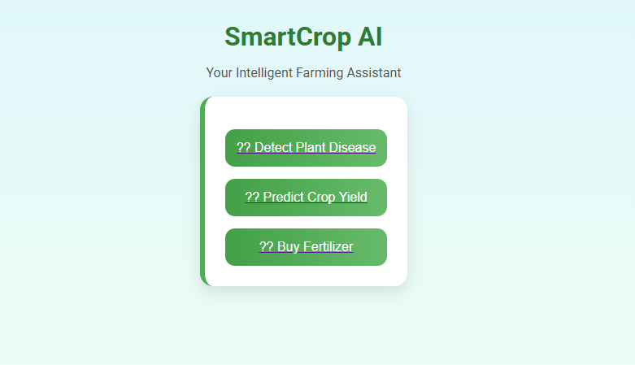
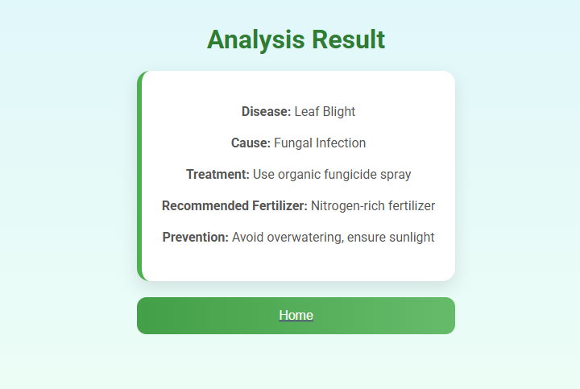
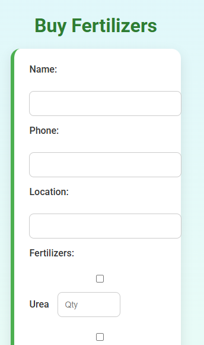
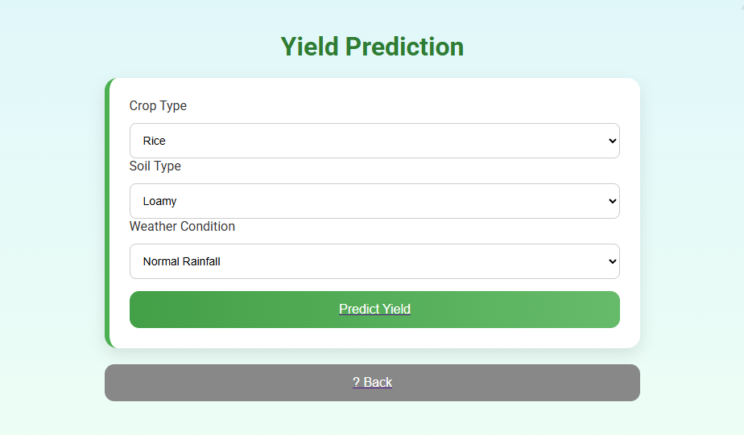

# SmartCrop AI!

SmartCrop AI is an intelligent farming assistant web application that helps farmers manage crop health and boost productivity. The platform offers three main functionalities:

1. **Plant Disease Detection:** Upload a leaf image to detect plant diseases and get treatment recommendations.
2. **Crop Yield Prediction:** Predict expected crop yield based on crop type, soil type, and weather conditions.
3. **Fertilizer Purchase:** Select fertilizers, specify quantities, enter location, and place an order.

---
## Features

- **Responsive Design:** Works perfectly on mobile, tablet, and desktop devices.
- **Interactive UI:** Cards, buttons, and forms for easy navigation.
- **Multi-page Structure:** Separate pages for disease detection, yield prediction, fertilizer list, and buying system.
- **Order Confirmation:** Displays detailed order summary after fertilizer purchase.

---
## Project Objectives

- Assist Farmers with Crop Management: Provide easy-to-use tools for monitoring crop health and predicting yields.
- Early Disease Detection: Enable farmers to detect plant diseases early through leaf image analysis.
- Yield Prediction: Estimate crop yield based on soil, crop type, and weather conditions to aid planning.
- Fertilizer Guidance: Recommend fertilizers based on crop needs and allow users to place orders.
- Responsive Design: Ensure the application works seamlessly on all devices (mobile, tablet, desktop).
- User-Friendly Interface: Provide an intuitive, interactive interface for easy navigation between features.

---
## Uses / Benefits

- Crop Health Management: Helps identify diseases early and provides treatment suggestions.
- Yield Forecasting: Helps farmers plan harvest and storage by predicting crop output.
- Fertilizer Planning: Guides farmers on which fertilizers to use for specific crops and problems.
- Time-Saving: Combines multiple farming tools into a single, easy-to-access platform.
- Educational Tool: Helps new farmers learn about crop diseases, soil types, and proper fertilizer use.
- Order Convenience: Users can directly select fertilizers, specify quantity, and place orders with location details.
### Screenshots

### Home Screen

### Disease

### Buy Fertilizer

  ### Predict

  
---
## Author

**JAYANTH D R**

